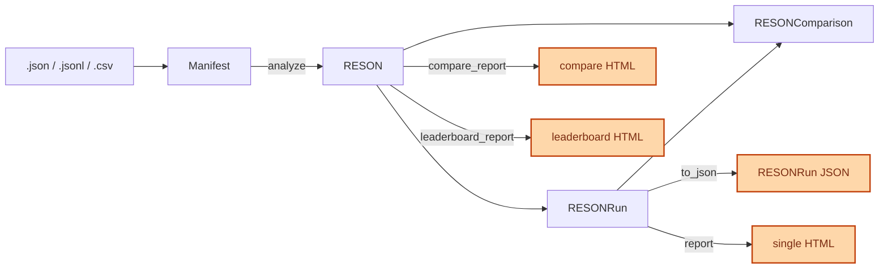

# Python API reference

Classes, attributes, and methods in RESON 1.0.0.

Step-by-step examples: [Python API tutorial](../tutorials/03_Python_API.md). CLI: [CLI tutorial](../tutorials/04_RESON_CLI.md).

## Contents

1. [Entity map](#entity-map)
2. [Public imports](#public-imports)
3. [Manifest record schema](#manifest-record-schema)
4. [Manifest](#manifest)
5. [RESON](#reson)
6. [RESONRun](#resonrun)
7. [RESONComparison](#resoncomparison)
8. [ErrorAnalyzer](#erroranalyzer)
9. [Statistics](#statistics)
10. [Metric providers](#metric-providers)
11. [TextNormalizer](#textnormalizer)
12. [Loaders](#loaders)
13. [HTML reports](#html-reports)
14. [Alerts](#alerts)

---


## Entity map




| Class                                   | What it is                                   |
| --------------------------------------- | -------------------------------------------- |
| [Manifest](#manifest)                   | Dataset: load, clean, split, sample          |
| [RESON](#reson)                         | One-model session: analyze, compare, reports |
| [RESONRun](#resonrun)                   | Result of one analysis. Persist it as JSON   |
| [RESONComparison](#resoncomparison)     | Difference between two runs                  |
| [ErrorAnalyzer](#erroranalyzer)         | Per-word errors: INS / DEL / SUB             |
| [Vocab](#vocab) / [Alphabet](#alphabet) | Word and character statistics                |
| [MetricProviderABC](#metricproviderabc) | Metrics backend (default: jiwer)             |


---


## Public imports

```python
from reson import Manifest, RESON, RESONRun, ErrorAnalyzer
```

Import everything else from its module when you need it:


| Names                                                                                       | Import from                   |
| ------------------------------------------------------------------------------------------- | ----------------------------- |
| `Manifest`, `Vocab`, `ManifestSummary`, `ReplaceVocabStats`, `RESONRun`                     | `reson.core`                  |
| `Alphabet`                                                                                  | `reson.core.stats`            |
| `RESON`                                                                                     | `reson.explorer`              |
| `ErrorAnalyzer`                                                                             | `reson.core.analysis.errors`  |
| `RESONComparison`, `compare_runs`                                                           | `reson.core.analysis.compare` |
| `MetricProviderABC`, `JiwerMetricProvider`                                                  | `reson.core.metrics.provider` |
| `TextNormalizer`                                                                            | `reson.core.text.normalize`   |
| `render_single_report_html`, `render_compare_report_html`, `render_leaderboard_report_html` | `reson.reporting`             |


---


## Manifest record schema

Each row is a dict:


| Field            | Type    | Description                                    |
| ---------------- | ------- | ---------------------------------------------- |
| `audio_filepath` | `str`   | Audio path or id. Join key when comparing runs |
| `duration`       | `float` | Duration in seconds                            |
| `text`           | `str`   | Reference transcript                           |
| `prediction`     | `str`   | ASR hypothesis                                 |


Duration bins:


| Label    | Range  |
| -------- | ------ |
| `short`  | ≤ 5 s  |
| `normal` | 5–30 s |
| `long`   | > 30 s |


Other columns are kept on load and save. Metrics and reports use the four fields above.

---


## Manifest

Source: `[reson/core/manifest.py](../reson/core/manifest.py)`

Load and transform a list of records. Methods return a **new** `Manifest` unless you pass `inplace=True`.

```python
Manifest(manifest: list[dict], stats: ManifestSummary | None = None)
```


| Parameter  | Description                                                  |
| ---------- | ------------------------------------------------------------ |
| `manifest` | List of records                                              |
| `stats`    | Precomputed summary. If omitted, it is built on first access |


### Properties


| Name             | Type               | Description                                               |
| ---------------- | ------------------ | --------------------------------------------------------- |
| `manifest`       | `list[dict]`       | Records                                                   |
| `vocab`          | `Vocab`            | Word counts from `text`                                   |
| `alphabet`       | `Alphabet`         | Character counts from `text`                              |
| `summary`        | `dict`             | Hours, record count, duration, sizes, normalization flags |
| `stats`          | `ManifestSummary`  | The same data as an object                                |
| `normalized`     | `bool`             | `True` after `normalize()`                                |
| `normalized_cfg` | `dict`             | Flags from the last `normalize()`                         |
| `replacements`   | `ReplaceVocabStats` or `None` | Substitution stats, or `None`                     |


### Methods

Each method below uses the same layout: signature, what it does, then a parameter table when the call takes arguments.

#### `load_from(source, **kwargs) -> Manifest`

Load records from a local file. `.json` may be a JSON array or JSON Lines. `.jsonl` is JSON Lines. `.csv` needs a header.

| Parameter | Description |
|-----------|-------------|
| `source` | Path to a `.json`, `.jsonl`, or `.csv` file |

```python
manifest = Manifest.load_from("data/eval.jsonl")
```

#### `to_json(path) -> None`

Write JSON Lines, one record per line.

| Parameter | Description |
|-----------|-------------|
| `path` | Output path. Parent directories are created |

#### `to_csv(path) -> None`

Write CSV without the index column.

| Parameter | Description |
|-----------|-------------|
| `path` | Output path. Parent directories are created |

#### `to_df() -> pandas.DataFrame`

Return a copy of the cached DataFrame.

#### `head(n=5) -> pandas.DataFrame`

Return the first rows as a DataFrame.

| Parameter | Description |
|-----------|-------------|
| `n` | Number of rows. Default `5` |

#### `rename(mapping, inplace=False) -> Manifest`

Rename columns.

| Parameter | Description |
|-----------|-------------|
| `mapping` | `{old_name: new_name}` |
| `inplace` | If `True`, update this object. Default `False` returns a new `Manifest` |

#### `select_columns(columns) -> Manifest`

Keep only the given columns. Always returns a new `Manifest`.

| Parameter | Description |
|-----------|-------------|
| `columns` | Column name or list of names |

#### `drop(columns) -> Manifest`

Drop columns. Always returns a new `Manifest`.

| Parameter | Description |
|-----------|-------------|
| `columns` | Column name or list of names |

#### `normalize(fields, remove_punct=True, lowercase=True, replace_yo=True, subst_table=None, inplace=False) -> Manifest`

Clean the selected text fields, in this order:

1. strip punctuation (`-` becomes a space)
2. lowercase and collapse spaces
3. apply a substitution dictionary, if one is passed
4. `ё` → `е`

| Parameter | Description |
|-----------|-------------|
| `fields` | Column name or list of names. Usually `["text", "prediction"]` |
| `remove_punct` | Strip punctuation. Default `True` |
| `lowercase` | Lowercase and collapse spaces. Default `True` |
| `replace_yo` | Replace `ё` with `е`. Default `True` |
| `subst_table` | `{canonical: [variants, ...]}`, path to a `;`-separated CSV, or `None` (default). The package does not ship a dictionary |
| `inplace` | If `True`, update this object. Default `False` returns a new `Manifest` |

CSV layout: canonical form first, then variants:

```csv
vpn;впн;випиэн
тв;тэвэ;тиви
```

After the call, `normalized` is `True`. If a dictionary was passed, `replacements` is filled.

```python
manifest.normalize(
    fields=["text", "prediction"],
    subst_table="tutorials/data/subst_table/example.csv",
)
```

#### `replace(columns, source, target, inplace=False) -> Manifest`

Replace literal substrings in the given columns.

| Parameter | Description |
|-----------|-------------|
| `columns` | Column name or list of names |
| `source` | String or list of strings to replace |
| `target` | Replacement string or list. A list must be the same length as `source` |
| `inplace` | If `True`, update this object. Default `False` returns a new `Manifest` |

#### `sample(n, shuffle=False, random_seed=None) -> Manifest`

Return a subset as a new `Manifest`.

| Parameter | Description |
|-----------|-------------|
| `n` | Row count (`int`), or a fraction in `(0, 1)` (`float`) |
| `shuffle` | Shuffle before taking rows. Default `False` |
| `random_seed` | Seed used when `shuffle=True` |

#### `train_test_split(test_size, random_state=42, shuffle=True, stratify=None) -> tuple[Manifest, Manifest]`

Split into train and test manifests.

| Parameter | Description |
|-----------|-------------|
| `test_size` | Fraction of rows for the test set, in `(0, 1)` |
| `random_state` | Shuffle seed. Default `42` |
| `shuffle` | Shuffle before the split. Default `True` |
| `stratify` | Optional column name whose value distribution is preserved |

```python
train, test = manifest.train_test_split(test_size=0.2, stratify="domain")
```

---


## RESON

Source: `[reson/explorer.py](../reson/explorer.py)`

One object per model (name, metrics, extra fields).

```python
RESON(
    name: str = "RESON Default Run",
    metrics: tuple[str, ...] | None = None,
    metric_provider: MetricProviderABC | None = None,
    meta: dict | None = None,
)
```


| Parameter         | Description                                                                                        |
| ----------------- | -------------------------------------------------------------------------------------------------- |
| `name`            | Default run name. Override with `analyze(..., run_name=...)`                                       |
| `metrics`         | For example `("WER", "CER")`. If omitted, the provider default is used (`WER` and `CER` for jiwer) |
| `metric_provider` | Custom backend. Default: `JiwerMetricProvider()`                                                   |
| `meta`            | Extra info copied into every `RESONRun` (checkpoint, dataset id, and so on)                        |


### Properties


| Name               | Type                | Description                                                             |
| ------------------ | ------------------- | ----------------------------------------------------------------------- |
| `name`             | `str`               | Session name                                                            |
| `metric_provider`  | `MetricProviderABC` | Active provider                                                         |
| `meta`             | `dict`              | Copied into runs                                                        |
| `last_run`         | `RESONRun`          | Result of the last `analyze()`. Raises if nothing has been analyzed yet |
| `last_run_context` | `RESONRunContext`   | Name, provider, and timestamps of the last analysis                     |
| `analyzer`         | `ErrorAnalyzer`     | Word-level errors on `last_run.manifest`                                |


### Methods

#### `analyze(manifest, artifacts_dir=None, *, run_name=None) -> RESONRun`

Compute metrics and vocabulary stats. `manifest` is a `Manifest` or a `list[dict]`.

| Parameter | Description |
|-----------|-------------|
| `manifest` | `Manifest` or `list[dict]` |
| `artifacts_dir` | Folder for files the provider writes. Created if it does not exist. Default `None` |
| `run_name` | Overrides `RESON.name` for this run |

```python
reson = RESON(name="candidate", metrics=("WER", "CER"), meta={"ckpt": "v3"})
run = reson.analyze(normalized, artifacts_dir="artifacts/candidate")
```

#### `analyze_many(manifests, *, names=None, artifacts_root_dir=None) -> list[RESONRun]`

Analyze several manifests in order.

| Parameter | Description |
|-----------|-------------|
| `manifests` | List of `Manifest` or `list[dict]` |
| `names` | Run names. Length must match `manifests` when given |
| `artifacts_root_dir` | Each run writes under `{root}/{name}` |

#### `compare(baseline, candidate, *, on="audio_filepath") -> RESONComparison`

Join two runs and return a [RESONComparison](#resoncomparison).

| Parameter | Description |
|-----------|-------------|
| `baseline` | Baseline `RESONRun` |
| `candidate` | Candidate `RESONRun` |
| `on` | Join column. Default `"audio_filepath"` |

#### `report_last(output_html="single_report.html", *, force_rebuild=False) -> str`

Write a single HTML report for `last_run`. Same as `last_run.report(...)`.

| Parameter | Description |
|-----------|-------------|
| `output_html` | Output path. Default `"single_report.html"` |
| `force_rebuild` | Rebuild the frontend for this call. Default `False` |

#### `compare_report(runs, *, model_names=None, output_html="model_compare_report.html", dataset_name=None, dataset_description="", base_model=None, target_model=None, additional_pairs=None, significance_pairs=None, num_bootstraps=2000, alpha=0.05) -> str`

Write a compare HTML report for **at least two** runs. Returns the output path.

| Parameter | Description |
|-----------|-------------|
| `runs` | At least two `RESONRun` objects |
| `model_names` | Labels in the report. Default: each `run.name` |
| `output_html` | Output path. Default `"model_compare_report.html"` |
| `dataset_name` | Dataset title in the report |
| `dataset_description` | Dataset description. Default `""` |
| `base_model` / `target_model` | Primary baseline and candidate. Default: the first and second names |
| `additional_pairs` | Extra `(baseline, candidate)` pairs in the UI |
| `significance_pairs` | Pairs that get a bootstrap test |
| `num_bootstraps` | Bootstrap iterations. Default `2000` |
| `alpha` | Significance level. Default `0.05` |

```python
reson.compare_report(
    runs=[run, baseline_run],
    model_names=["candidate", "baseline"],
    output_html="artifacts/reports/compare.html",
    base_model="baseline",
    target_model="candidate",
)
```

#### `leaderboard_report(runs, *, model_names=None, model_display_names=None, output_html="leaderboard_report.html", dataset_name=None) -> str`

Write a leaderboard HTML report. Needs at least two runs.

| Parameter | Description |
|-----------|-------------|
| `runs` | At least two `RESONRun` objects |
| `model_names` | Model ids. Default: each `run.name` |
| `model_display_names` | Labels shown in the UI |
| `output_html` | Output path. Default `"leaderboard_report.html"` |
| `dataset_name` | Dataset title in the report |


### RESONRunContext

Filled after each `analyze()`. Read it as `reson.last_run_context`.


| Field                        | Type              | Description                |
| ---------------------------- | ----------------- | -------------------------- |
| `run_name`                   | `str`             | Run name                   |
| `provider_name`              | `str`             | Provider class name        |
| `metrics`                    | `tuple[str, ...]` | Metrics that were computed |
| `artifacts_dir`              | `str` or `None`   | Folder passed to `analyze()` |
| `started_at` / `finished_at` | `str`             | ISO timestamps             |


---


## RESONRun

Source: `[reson/core/analysis/run.py](../reson/core/analysis/run.py)`

Immutable result of one analysis. Save it, share it, and pass it to reports.

```python
@dataclass(frozen=True)
class RESONRun:
    name: str
    summary: dict
    metrics: pandas.DataFrame
    manifest: pandas.DataFrame
    vocab: Vocab
    alphabet: Alphabet
    replacements: ReplaceVocabStats | None
    artifacts: dict[str, str]
    config: dict
    meta: dict
```


| Field          | Description                                                                                                                                    |
| -------------- | ---------------------------------------------------------------------------------------------------------------------------------------------- |
| `name`         | Run / model name                                                                                                                               |
| `summary`      | Same keys as `Manifest.summary`                                                                                                                |
| `metrics`      | One row per metric. Index is the name. Typical columns: `VALUE`, `mean_value`, `sd`; WER/CER also have `INS`, `DEL`, `SUB`, `EQ`, `NOM`, `LEN` |
| `manifest`     | One row per record: original fields plus `WER`, `CER`, `INS` / `DEL` / `SUB`, `duration_type`                                                  |
| `vocab`        | Word stats (after analyze, also recall / precision / F1 / WIS)                                                                                 |
| `alphabet`     | Character counts                                                                                                                               |
| `replacements` | Substitution stats, or `None`                                                                                                                  |
| `artifacts`    | Files written under `artifacts_dir`                                                                                                            |
| `config`       | `normalized`, `normalize_cfg`, `metric_provider`                                                                                               |
| `meta`         | Copy of `RESON.meta`                                                                                                                           |


`print(run)` prints a short summary.

### Methods

JSON `schema_version` is `"1.0"`.

#### `to_json(path) -> str`

Write JSON and return the path.

| Parameter | Description |
|-----------|-------------|
| `path` | Output path. Parent directories are created |

#### `from_json(path) -> RESONRun`

Load a run from a JSON file.

| Parameter | Description |
|-----------|-------------|
| `path` | Path to a `RESONRun` JSON file |

#### `to_dict() -> dict`

Return the same payload as a dict.

#### `from_dict(payload) -> RESONRun`

Load a run from a dict.

| Parameter | Description |
|-----------|-------------|
| `payload` | Dict produced by `to_dict()` |

```python
run.to_json("artifacts/runs/candidate.json")
restored = RESONRun.from_json("artifacts/runs/candidate.json")
```

#### `report(output_html="single_report.html", *, force_rebuild=False) -> str`

Write a single-run HTML file.

| Parameter | Description |
|-----------|-------------|
| `output_html` | Output path. Default `"single_report.html"` |
| `force_rebuild` | Rebuild the frontend for this call. Default `False` |

---


## RESONComparison

Source: `[reson/core/analysis/compare.py](../reson/core/analysis/compare.py)`

Difference of two runs. Returned by `reson.compare(...)` or `compare_runs(...)`.

```python
compare_runs(baseline: RESONRun, rc: RESONRun, on: str = "audio_filepath") -> RESONComparison
```

`rc` is the candidate. Rows are inner-joined on `on`.


| Field                    | Type        | Description                                                                                            |
| ------------------------ | ----------- | ------------------------------------------------------------------------------------------------------ |
| `baseline` / `rc`        | `str`       | Run names                                                                                              |
| `metrics_delta`          | `DataFrame` | Per metric: `baseline`, `rc`, `diff_abs`, `diff_rel_pct`, plus INS/DEL/SUB on each side                |
| `per_file_delta`         | `DataFrame` | Joined records, columns suffixed `_baseline` / `_rc`                                                   |
| `merged_vocab`           | `DataFrame` | Joined vocabulary, with `delta_recall` / `delta_precision` / `delta_f1_score` when those columns exist |
| `word_ops_stats`         | `dict`      | `{word: {"baseline": {ins, del, sub, sub_as_dst}, "rc": {...}}}`                                       |
| `matched_rows`           | `int`       | How many records matched                                                                               |
| `by_slice` / `artifacts` |             | Unused for now                                                                                         |


### Methods

#### `metrics_delta_records() -> list[dict]`

Return `metrics_delta` as a list of dicts. Empty if the two runs share no metrics.

#### `compute_significance(*, stratify_col=None, num_bootstraps=2000, seed=42, alpha=0.05) -> dict`

Bootstrap the corpus WER difference (`candidate − baseline`).

| Parameter | Description |
|-----------|-------------|
| `stratify_col` | Column to stratify on, or `None`. A plain name (`duration_type`) or a suffixed join column |
| `num_bootstraps` | Number of iterations. Default `2000` |
| `seed` | Random seed. Default `42` |
| `alpha` | Significance level. Default `0.05` |

| Key | Meaning |
|-----|---------|
| `num_bootstraps` | Number of iterations |
| `ci95` | `(low, high)` interval of the WER delta |
| `p_one_sided` | Share of deltas ≥ 0 |
| `p_two_sided` | Two-sided p-value |
| `alpha` | Alpha that was used |
| `stratified_by` | Stratification column, or `None` |

```python
comparison.compute_significance(stratify_col="duration_type", num_bootstraps=2000)
```

---


## ErrorAnalyzer

Source: `[reson/core/analysis/errors.py](../reson/core/analysis/errors.py)`

Word-level alignment over a DataFrame. After `analyze()` it is available as `reson.analyzer`.

```python
ErrorAnalyzer(manifest: pandas.DataFrame)
```

The DataFrame needs `text` and `prediction` (usually `run.manifest`).

### Methods

#### `word_replacements(return_df=False)`

Return source word → `(replaced_with, count)` pairs, most frequent first.

| Parameter | Description |
|-----------|-------------|
| `return_df` | If `True`, return a DataFrame with columns `source_word`, `replaced_with`, `count`. Default `False` |

#### `word_replacement_examples(max_examples=None) -> dict`

Return examples keyed by `"source|||target"`. Each item has `audio_filepath`, `text`, `prediction`, `diff_html`, and `diff_plain`.

| Parameter | Description |
|-----------|-------------|
| `max_examples` | Cap the number of examples per pair. Default `None` keeps all of them |

#### `word_ops_stats(*, include_sub_as_dst=False, return_df=False)`

Count INS / DEL / SUB per word.

| Parameter | Description |
|-----------|-------------|
| `include_sub_as_dst` | Also count substitution targets in `sub_as_dst`. Default `False` |
| `return_df` | If `True`, return a DataFrame. Default `False` returns a dict |

#### `word_error_examples(*, include_sub_as_dst=False) -> dict`

Return `{word: {"ins": [...], "del": [...], "sub": [...]}}`.

| Parameter | Description |
|-----------|-------------|
| `include_sub_as_dst` | Include hypothesis tokens that were substitution targets. Default `False` |

#### `word_quality_metrics(vocab_words=None) -> dict`

Return per-word `recall`, `precision`, and `f1_score`.

| Parameter | Description |
|-----------|-------------|
| `vocab_words` | `{word: reference_count}`. If omitted, counts come from the alignment |


---


## Statistics

Source: `[reson/core/stats.py](../reson/core/stats.py)`

### Vocab

Word-level table (`vocab.data`).

Columns: `word`, `count`. After analyze, also `recall`, `precision`, `f1_score`, `insertions`, `deletions`, `substitutions`, `wis`.


| Name | Description |
|------|-------------|
| `size` | Number of words |
| `russian` / `english` / `numeric` / `other` | Subsets (each is a `Vocab`) |
| `mean_recall` / `mean_precision` / `mean_f1score` / `mean_wis` | Means. Raises if the column is missing |

### Methods

#### `top_words(n=10, by="count", ascending=False, min_count=1, min_len=1) -> pandas.DataFrame`

Return the top rows after basic filters.

| Parameter | Description |
|-----------|-------------|
| `n` | How many rows to return. Default `10` |
| `by` | Sort column. Default `"count"` |
| `ascending` | Sort direction. Default `False` |
| `min_count` | Drop words below this count. Default `1` |
| `min_len` | Drop words shorter than this. Default `1` |

#### `find_word(word, exact=False, startswith=False, case=False, regex=False) -> pandas.DataFrame`

Search the `word` column.

| Parameter | Description |
|-----------|-------------|
| `word` | Query string |
| `exact` | Full match. Default `False` (substring) |
| `startswith` | Prefix match. Default `False` |
| `case` | Case-sensitive match. Default `False` |
| `regex` | Treat `word` as a regular expression. Default `False` |

#### `to_csv(path) -> None`

Write `vocab.data` to CSV.

| Parameter | Description |
|-----------|-------------|
| `path` | Output path |

#### `to_jsonl(path) -> None`

Write `vocab.data` as JSON Lines. `to_json` does the same thing.

| Parameter | Description |
|-----------|-------------|
| `path` | Output path |

`vocab_a - vocab_b` is the words in `a` that are not in `b`.

**WIS** (word importance score) is a 0–100 score. HTML reports use it to rank words worth inspecting.

### Alphabet

Character table: columns `char`, `count`.


| Name | Description |
|------|-------------|
| `size` | Number of distinct characters |
| `chars` | Sorted unique characters |
| `russian` / `english` / `numeric` / `other` | Subsets |

### Methods

#### `from_records(records) -> Alphabet`

Build an alphabet from a list of dicts.

| Parameter | Description |
|-----------|-------------|
| `records` | `[{"char", "count"}, ...]` |

#### `to_csv(path) -> None`

Write the character table to CSV.

| Parameter | Description |
|-----------|-------------|
| `path` | Output path |

#### `to_jsonl(path) -> None`

Write the character table as JSON Lines. `to_json` does the same thing.

| Parameter | Description |
|-----------|-------------|
| `path` | Output path |


### ManifestSummary

Usually read via `manifest.stats` / `manifest.summary`, not built by hand.


| Field                                | Description                           |
| ------------------------------------ | ------------------------------------- |
| `total_samples`                      | Record count                          |
| `total_duration`                     | `HH:MM:SS` (hours may exceed 24)      |
| `duration_info`                      | mean, std, min, percentiles, max      |
| `duration_type`                      | Counts of `short` / `normal` / `long` |
| `vocab_records` / `alphabet_records` | Raw lists for `Vocab` / `Alphabet`    |
| `replace_stats`                      | Optional `ReplaceVocabStats`          |
| `normalized` / `normalized_cfg`      | Normalization flags                   |


Keys in `summary`: `Number of hours`, `Number of utterances`, `Duration types`, `Duration info`, `Vocabulary size`, `Alphabet size`, `Normalized`, `Normalization config`, and, if a substitution dictionary was used, `Replacements total` and `Replacements by field`.

### ReplaceVocabStats

Collected while a substitution dictionary is applied.


| Field                | Description                                       |
| -------------------- | ------------------------------------------------- |
| `vocab`              | `{canonical: [variants, ...]}`                    |
| `fields`             | Replacement counts per column                     |
| `words`              | Hit counts per variant                            |
| `examples`           | `{row index: [(field, variant, canonical), ...]}` |
| `total_replacements` | Sum of `fields`                                   |


---


## Metric providers

Source: `[reson/core/metrics/provider.py](../reson/core/metrics/provider.py)`

The CLI supports `jiwer` only. In Python you can pass any `MetricProviderABC`.

### MetricProviderABC

```python
class MetricProviderABC(ABC):
    artifacts_dir: str | Path | None
    metrics: tuple[str, ...]

    def evaluate(self, manifest: Manifest) -> tuple[DataFrame, DataFrame]: ...
    def postprocess(self, per_file_df: DataFrame, *, vocab_df: DataFrame | None = None) -> tuple[DataFrame, Vocab]: ...
```

### Methods

#### `evaluate(manifest) -> tuple[DataFrame, DataFrame]`

Score a manifest.

| Parameter | Description |
|-----------|-------------|
| `manifest` | `Manifest` to score |

Returns two tables:

1. **Per record** — one row per utterance: `audio_filepath`, `duration`, `text`, `prediction`, plus `WER` / `INS` / `DEL` / `SUB` and columns for any other metrics (`CER`, and so on).
2. **Summary** — one row per metric name. Typical columns: `VALUE`, `mean_value`, `sd`, and, when computed, `INS`, `DEL`, `SUB`, `EQ`, `NOM`, `LEN`.

#### `postprocess(per_file_df, *, vocab_df=None) -> tuple[DataFrame, Vocab]`

Add duration bins and per-word scores. The default on `BaseMetricProvider` adds `duration_type` and per-word recall / precision / F1. `analyze()` then adds INS / DEL / SUB and WIS.

| Parameter | Description |
|-----------|-------------|
| `per_file_df` | Table returned by `evaluate` |
| `vocab_df` | Word counts used to attach recall / precision / F1. Default `None` |

### JiwerMetricProvider

The default provider.

```python
JiwerMetricProvider(
    artifacts_dir: str | Path | None = None,
    metrics: tuple[str, ...] = ("WER", "CER"),
)
```

Names: `WER`, `CER` (case-insensitive). Values are percentages.

### Custom provider

```python
from reson.core.metrics.provider import BaseMetricProvider

class MyProvider(BaseMetricProvider):
    artifacts_dir = None
    metrics = ("WER", "CER")

    def evaluate(self, manifest):
        per_file_df = ...
        summary_df = ...
        return per_file_df, summary_df

reson = RESON(name="exp", metric_provider=MyProvider())
```

Subclass `BaseMetricProvider` to keep the default `postprocess`, or implement both methods on `MetricProviderABC`.

---


## TextNormalizer

Source: `[reson/core/text/normalize.py](../reson/core/text/normalize.py)`

Used by `Manifest.normalize()`. Call it directly if you already have a DataFrame.

```python
TextNormalizer(
    remove_punct: bool = True,
    lowercase: bool = True,
    replace_yo: bool = True,
    subst_table: dict[str, list[str]] | Path | str | None = None,
)
```


| Name | Description |
|------|-------------|
| `config` | The four constructor flags |
| `stats` | `ReplaceVocabStats` after `fit()` with a dictionary, otherwise `None` |
| `variant2target` | variant → canonical form |

### Methods

#### `fit() -> TextNormalizer`

Load the substitution dictionary and compile the replacement pattern.

#### `transform(df, fields) -> pandas.DataFrame`

Normalize the given columns.

| Parameter | Description |
|-----------|-------------|
| `df` | DataFrame to copy and normalize |
| `fields` | Column names to normalize |

#### `fit_transform(df, fields) -> pandas.DataFrame`

Call `fit()`, then `transform()`.

| Parameter | Description |
|-----------|-------------|
| `df` | DataFrame to copy and normalize |
| `fields` | Column names to normalize |

#### `transform_series(series, field_name=None) -> pandas.Series`

Normalize one column.

| Parameter | Description |
|-----------|-------------|
| `series` | Text column |
| `field_name` | Name recorded in replacement stats. Default `None` |

Helpers: `remove_punctuation(text)`, `to_lowercase(text)`.

---


## Loaders

Source: `[reson/io/loader.py](../reson/io/loader.py)`

`Manifest.load_from()` uses `default_registry()`.


| Class               | Reads                                              |
| ------------------- | -------------------------------------------------- |
| `JsonlLoader`       | `.json`, `.jsonl`                                  |
| `CsvLoader`         | `.csv`                                             |
| `LoaderRegistry`    | The first loader that accepts the path             |
| `DataSourceAdapter` | A custom source: implement `can_handle` and `load` |


```python
from reson.io.loader import DataSourceAdapter, LoaderRegistry, JsonlLoader, CsvLoader

class MyLoader(DataSourceAdapter):
    def can_handle(self, source: str) -> bool: ...
    def load(self, source: str, **kwargs) -> list[dict]: ...

registry = LoaderRegistry([MyLoader(), JsonlLoader(), CsvLoader()])
manifest = Manifest(registry.load("..."))
```

---


## HTML reports

Source: `[reson/reporting/](../reson/reporting/)`

Usually call `run.report()`, `reson.compare_report()`, or `reson.leaderboard_report()`. Ready-made files you can open in a browser: [single](../examples/SingleRun.html), [compare](../examples/CompareExample.html), [leaderboard](../examples/LeaderBoardExample.html). The functions behind generation:


| Function                                                           | Input                     | Output           |
| ------------------------------------------------------------------ | ------------------------- | ---------------- |
| `render_single_report_html(run, output_html="single_report.html")` | `RESONRun` or a JSON path | single HTML      |
| `render_compare_report_html(runs, ...)`                            | at least two `RESONRun`s  | compare HTML     |
| `render_compare_report_from_files(paths, model_names, ...)`        | JSON paths                | compare HTML     |
| `render_leaderboard_report_html(runs, ...)`                        | at least two `RESONRun`s  | leaderboard HTML |
| `render_leaderboard_report_from_files(paths, ...)`                 | JSON paths                | leaderboard HTML |


Each report is one HTML file (data in `window.RESON_DATA`). How it is built: [HTML reports](html-reports.md).

---


## Alerts

Source: `[reson/core/analysis/alerts.py](../reson/core/analysis/alerts.py)`

Data-quality checks for the single HTML report. Not required for `analyze()`.

```python
from reson.core.analysis.alerts import AlertAnalyzer, Alert

analyzer = AlertAnalyzer(run.manifest, vocab_df=run.vocab.data, metrics_df=run.metrics)
alerts: list[Alert] = analyzer.compute()
```


| Field      | Description                                   |
| ---------- | --------------------------------------------- |
| `code`     | Identifier, for example `manifest.duplicates` |
| `message`  | Text                                          |
| `severity` | `"info"`, `"warning"`, or `"error"`           |
| `entity`   | `"manifest"`, `"vocab"`, or `"metrics"`       |
| `kind`     | Badge label in the UI                         |
| `data`     | Optional extra payload                        |


### Methods

#### `AlertAnalyzer.compute() -> list[Alert]`

Run the configured rules and return the alerts.

#### `Alert.to_dict() -> dict`

Return the alert as a dict. Empty `data` is omitted.

Default checks: missing required columns, duplicate audio paths, empty `text` / `prediction`, odd durations, WER distribution shape, vocabulary coverage, and similar cases. Pass your own set as `rules=[...]` to `AlertAnalyzer`. Each `AlertRule` implements `evaluate(context) -> list[Alert]`.

---

